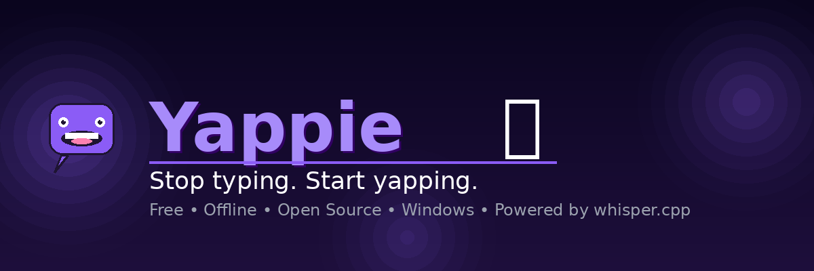

<p align="center">
  
</p>

<h1 align="center">Yappie 🗣️</h1>

<p align="center"><strong>Stop typing. Start yapping.</strong></p>

<p align="center">
  <em>Free, offline voice dictation for Windows. No cloud. No subscription. No cap.</em>
</p>

Hold a hotkey, speak, release — your words appear wherever your cursor is. Powered by whisper.cpp, running 100% on your machine.


---

## Why Yappie?

> Wispr Flow costs $17/month. Yappie costs $0/month. Forever.

| Feature | Yappie | Wispr Flow |
|---------|--------|------------|
| Price | **Free** | $17/month |
| Offline | **✅ 100%** | ❌ Cloud |
| Open Source | **✅** | ❌ |
| Privacy | **✅ Local only** | ❌ Cloud processing |
| Platform | Windows | Mac/Windows |

Yappie is the free, open-source, fully-offline alternative to Wispr Flow. Your voice never leaves your machine.

---

## Download

Get the latest from [Releases](https://github.com/birbusTeam-oss/Quill/releases):
- **Yappie.exe** — portable, just run it
- **Yappie-v1.2.0-windows-x64.zip** — same thing, zipped

No install required. First launch auto-downloads the speech engine (~150MB one-time). After that, everything runs locally — forever.

---

## How It Works

1. Launch Yappie — a small purple dot appears at the bottom of your screen
2. Hold **Ctrl+Alt** and speak
3. Release — text appears at your cursor

That's it. Works everywhere: browsers, text editors, Slack, Notion, Discord — anywhere you can type.

---

## Features

- 🎙️ **Fully offline** — whisper.cpp runs locally, nothing leaves your machine
- ⚡ **Hold-to-talk** — hold Ctrl+Alt, speak, release
- 🤖 **Auto-setup** — downloads whisper.cpp + model on first launch
- 💜 **Floating overlay** — shows recording → transcribing → done status
- 🪟 **System tray** — runs quietly in background, start with Windows option
- 🧹 **Smart cleanup** — removes filler words (um, uh, er), trims silence
- 🚀 **Fast** — model pre-warming, greedy decoding, silence trimming
- 🪶 **Tiny** — ~6.6MB binary, zero dependencies

---

## Configuration

Config lives at `%APPDATA%\Yappie\config.json`:

```json
{
  "hotkey": "Ctrl+Alt",
  "log_transcriptions": true,
  "remove_fillers": true
}
```

---

## Build from Source

```bash
git clone https://github.com/birbusTeam-oss/Quill.git
cd Quill
go install github.com/tc-hib/go-winres@latest
go-winres make
GOOS=windows GOARCH=amd64 go build -ldflags="-H windowsgui -s -w" -o Yappie.exe ./cmd/quill
```

## Requirements

- Windows 10/11 (x64)
- A microphone
- ~150MB disk space (whisper + model, auto-downloaded)

---

## About

Yappie is a free, open-source voice dictation tool for Windows. It uses [whisper.cpp](https://github.com/ggerganov/whisper.cpp) for offline speech-to-text — the same technology behind expensive cloud tools, running entirely on your device.

**Keywords:** voice dictation, speech to text, offline, free, open source, Windows, whisper, whisper.cpp, voice typing, dictation software, Wispr Flow alternative, yapping

---

## License

MIT

---

Built by [Birbus Team](https://github.com/birbusTeam-oss) · *Stop typing. Start yapping.* 🗣️
